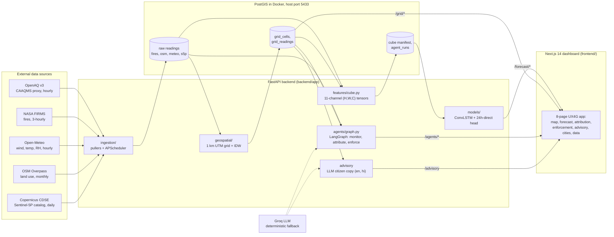
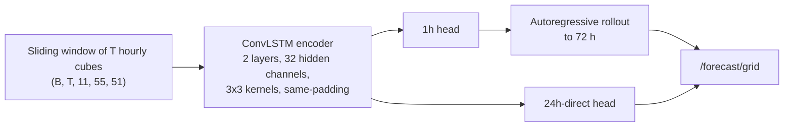
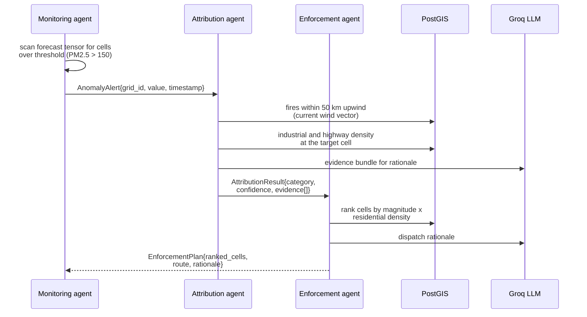

# UrbanAir Intel

An AI-powered urban air quality intelligence platform built for the
"AI-Powered Urban Air Quality Intelligence for Smart City Intervention"
hackathon problem statement. It fuses ground sensor data, satellite products,
fire detections, land use vectors, and meteorology into a 1 km gridded digital
twin of a city's airshed, then layers three intelligence capabilities on top:
hyperlocal PM2.5 forecasting that beats the persistence baseline at the judged
24 hour horizon, LLM-assisted pollution source attribution with evidence and
confidence scores, and agent-generated enforcement patrol routes. A citizen
advisory system generates plain-language health guidance in English and Hindi.

Delhi NCR is the primary demo city. The entire pipeline is keyed by
`city_slug`, so onboarding a second city is a bounding box entry plus a
training run, not a redesign.

Full build history: [`docs/BUILD_PLAN.md`](docs/BUILD_PLAN.md).
Frontend route and endpoint contract: [`SITEMAP.md`](SITEMAP.md).
Demo script and deck outline: [`docs/DEMO.md`](docs/DEMO.md).
Production deploy (Railway + Supabase + Upstash + Vercel): [`docs/DEPLOY.md`](docs/DEPLOY.md).

## System architecture



Everything downstream of ingestion is addressed by the same spatial index:
`grid_cells.grid_id` with `row_idx` and `col_idx` giving the model its 2D
array layout. That single shared index is what lets ingestion output, feature
cubes, forecast tensors, and agent output all reference the same 1 km cell.

## Data layer

Five pullers, each matched to its source's real API and cadence, scheduled
in-process with APScheduler and also manually triggerable over HTTP for demos:

| Puller | Source | Cadence | Detail |
|---|---|---|---|
| `caaqms_openaq.py` | OpenAQ v3 (CAAQMS proxy) | hourly | pm25, pm10, no2, so2, co, o3. Sensor dropouts under 3 hours are gap-filled by linear interpolation. Uses `/locations/{id}/latest` for hourly pulls and `/sensors/{id}/hours` for backfill, since v3 removed the per-location measurements endpoint. |
| `firms_fires.py` | NASA FIRMS area CSV API | every 3 h | VIIRS_SNPP_NRT and MODIS_NRT detections with confidence, fire radiative power in megawatts, and day/night flag. |
| `open_meteo.py` | Open-Meteo | hourly | Wind speed and direction, temperature, relative humidity per city. The archive API lags about two days, so recent hours are covered by the forecast API's `past_days` window. |
| `osm_landuse.py` | OSM Overpass | monthly | Industrial and residential landuse polygons, primary and trunk highways. Full-city queries time out, so the bounding box is tiled 4x4 and the query runs against mirror instances. |
| `sentinel5p.py` | Copernicus CDSE OData | daily | L2 NO2 and SO2 product metadata (id, sensing window, NRTI/OFFL). Raster download and regridding is a documented open slot in the feature cube, flagged as NaN rather than silently zero-filled. |

Raw rows land in plain lat/lon tables (`caaqms_readings`, `fire_detections`,
`osm_land_use_features`, `sentinel5p_products`, plus an `ingestion_run_log`).
PostGIS geometry only enters at the grid layer, where it is needed.

## Geospatial grid engine

The city bounding box is projected to UTM zone 43N (EPSG:32643) and tiled
into 1 km by 1 km cells. Delhi NCR yields 2,805 cells in a 55 by 51 array.
Generation is deterministic and idempotent; re-running does not duplicate
cells.

Every hour, irregular station readings are interpolated onto cell centroids
with inverse distance weighting:

```
Z(x0) = sum_i( w_i * Z_i ) / sum_i( w_i ),   w_i = 1 / d(x0, x_i)^p
```

with power p = 2 and a 15 km search radius, so a cell far from any station
reports nothing instead of a falsely confident estimate. The implementation
is vectorized with NumPy (one distance matrix per parameter per hour, not a
per-cell loop). Interpolation quality is validated by leave-one-out
cross-validation: hold out one station, predict its value from the rest,
compare. Results are written to `grid_readings` together with the
contributing sensor count that the frontend surfaces per cell.

## Feature cubes

Each hourly timestep is fused into an 11-channel tensor of shape (55, 51, 11):

| Channels | Content |
|---|---|
| 1, 2 | IDW-interpolated PM2.5 and PM10 |
| 3 | NO2 slot (Sentinel-5P regrid, currently NaN-flagged, see data layer) |
| 4 | Fire radiative power proxy rasterized from FIRMS detections |
| 5, 6 | Road density (km of primary or trunk road per square km) and industrial land use fraction, rasterized from OSM vectors |
| 7 to 10 | Wind speed, wind direction, temperature, relative humidity |
| 11 | Valid-data mask |

Tensors are stored as `.npy` files on disk with a `feature_cube_manifest`
table in Postgres pointing at them, since multi-megabyte tensors do not
belong in relational rows. A 90 day backfill produced 2,163 hourly cubes for
training.

## Forecasting model



The core is a ConvLSTM: each cell fuses the current cube with its hidden
state through a convolution producing the four LSTM gates, so spatial
structure is preserved through time. Two configurations are trained:

- A 1 hour ahead model whose predictions are fed back autoregressively to
  roll out 24, 48, and 72 hour horizons for the map's timeline scrubber.
- A 24 hour direct model, because the problem statement judges forecast
  accuracy at 24 hours and autoregressive rollouts compound error. Predicting
  the target horizon directly avoids that compounding.

Training uses a strict chronological train/validation/test split (no
shuffling, which would leak future data into training), MSE loss, and early
stopping on validation RMSE. Evaluation reports RMSE against the persistence
baseline (tomorrow equals today at the same cell), which the brief names as
the reference point. Current checkpoint results on held-out test windows:

| Horizon | Model RMSE | Persistence RMSE | Verdict |
|---|---|---|---|
| 24 h | 33.7 | 34.4 | model beats baseline |
| 1 h | 19.1 | 19.1 | statistical tie, expected at short horizons |

The 1 hour tie is the known behavior of persistence at short horizons, where
it is nearly unbeatable; the 24 hour direct result is the one the brief
scores. Metrics are served at `/forecast/metrics` and rendered in the
dashboard rather than living only in a notebook.

## Multi-agent intelligence layer



The graph is built with LangGraph. Every handoff is a typed Pydantic model
(`AnomalyAlert`, `AttributionResult`, `EnforcementPlan`), and the frontend
renders exactly these objects, so an administrator sees the same evidence the
agents reasoned over: which fires were upwind, what the land use mix at the
cell is, and why each patrol stop was ranked where it was.

The LLM provider is pluggable through `LLM_PROVIDER` in `.env` (Groq by
default, Anthropic as an alternative). Every LLM call has a deterministic
fallback, so the pipeline completes and produces attributions and routes even
with no API key configured; responses are marked `llm_used: false` in that
case. Because real anomalies may not occur during a demo window, `POST
/agents/run?synthetic_grid_id=` injects a synthetic anomaly at a chosen cell
and runs the full graph against otherwise real data.

## Citizen advisory

`GET /advisory?lang=en|hi` computes the current city mean and peak PM2.5 from
the gridded snapshot, maps them to the CPCB category bands, and generates
plain-language health guidance with the LLM (again with a deterministic
template fallback). Six languages are live — English, Hindi, Kannada, Tamil,
Bengali, Marathi (`lang=en|hi|kn|ta|bn|mr`) — each generated in its own
script, not string-swapped, with a script-correct fallback template per
language.

## Frontend

Next.js 14 (App Router, TypeScript, Tailwind) styled with UX4G, India's
government design system, via the official `ux4g-web-components` package.
UX4G primary and secondary token ramps are mapped into Tailwind as `gov-*`
and `saffron-*`, and real UX4G component classes are used throughout: cards,
buttons (primary, outline, danger), alerts, tables, breadcrumbs, and progress
bars. Iconography is lucide-react. Motion (staggered reveals, count-up
statistics, route transitions, an animated nav indicator) is framer-motion,
and every animation respects `prefers-reduced-motion`.

| Route | Purpose |
|---|---|
| `/` | City overview: KPI cards, advisory, latest intervention |
| `/map` | Leaflet heatmap of the 1 km grid with a live-to-72h horizon scrubber and enforcement route overlay |
| `/forecast` | Recharts line chart of model versus persistence (palette validated for colorblind separation), plus a per-horizon table |
| `/attribution` | Attribution runs with confidence progress bars and expandable evidence |
| `/enforcement` | Drill trigger, alert-to-route panel, run history |
| `/advisory` | Language switcher, advisory text, CPCB band reference |
| `/cities` | Multi-city comparison, Delhi NCR live |
| `/data` | Source table, grid stats, pipeline status |

An app-wide UX4G warning banner appears whenever the backend is unreachable
and names the exact command to start it. Accessibility is built in: skip
link, breadcrumbs, `aria-current` navigation, radiogroup semantics on
toggles, `aria-live` for map cell selection, `lang` attributes on translated
text, and data tables as the accessible equivalent of the map and chart.
The per-route endpoint contract, including endpoints the UI is already built
to consume once the backend grows them, is maintained in
[`SITEMAP.md`](SITEMAP.md).

## API reference

| Method and path | Purpose |
|---|---|
| `GET /health` | Liveness plus environment name |
| `POST /ingestion/{caaqms,firms,osm,sentinel5p,meteo}/run` | Manual pull per source |
| `GET /ingestion/status` | Run history from `ingestion_run_log` |
| `GET /ingestion/summary` | Consolidated per-source health: last run, row counts, data freshness |
| `POST /grid/generate` | One-time grid generation for a city |
| `POST /grid/materialize` | IDW of the latest hour onto the grid |
| `GET /grid/cells` | Cell centroids and array indices |
| `GET /grid/readings?parameter=` | Latest gridded snapshot |
| `GET /forecast/grid?horizon_hours=` | Full-grid rollout up to 72 h |
| `GET /forecast/cell/{grid_id}` | Per-cell observed history plus hourly forecast series |
| `GET /forecast/metrics` | RMSE versus persistence, 1 h and 24 h |
| `POST /agents/run?synthetic_grid_id=` | Run the agent graph, optionally on an injected anomaly |
| `GET /agents/recommendations` | Recent enforcement plans |
| `GET /agents/runs?limit=&offset=` | Paginated run history with dispatch state and response-time metric |
| `POST /agents/runs/{id}/status` | Dispatch lifecycle: new → dispatched → inspected → closed |
| `GET /advisory?lang=` | Citizen health advisory (`en`, `hi`, `kn`, `ta`, `bn`, `mr`) |
| `GET /stats/summary` | Server-computed city snapshot: mean, max, CPCB category, 24 h trend |
| `GET /stations` | CAAQMS station locations and freshness for map markers |
| `GET /cities` | Registered cities with live/onboarding state and headline stats |

## Getting started

Prerequisites: Docker with Compose, Node 20+, Python 3.11+.

```bash
# 1. Environment file; keys are only needed by the steps that use them
cp .env.example .env

# 2. PostGIS and Redis
docker compose up -d
# Note: the container maps to host port 5433 to avoid colliding with a
# native PostgreSQL on 5432. DATABASE_URL must point at 5433.

# 3. Backend
cd backend
python -m venv .venv && source .venv/bin/activate
pip install -r requirements.txt
uvicorn app.main:app --reload --port 8000

# 4. One-time pipeline bootstrap
curl -X POST localhost:8000/ingestion/caaqms/run
curl -X POST localhost:8000/grid/generate
curl -X POST localhost:8000/grid/materialize

# 5. Frontend, separate terminal
cd frontend
npm install
npm run dev
# http://localhost:3000
```

Training the model end to end (backfill, cube build, train, evaluate) is
scripted in `backend/scripts/`; long-running jobs live there deliberately,
because a long in-flight request pins uvicorn's reload worker and makes
reloads silently fail to apply.

## Testing

```bash
cd backend && pytest tests/ -v
```

59 tests, all green. Every external HTTP boundary (OpenAQ, FIRMS, Overpass,
CDSE, Open-Meteo, LLM providers) is mocked, so the suite runs without any
API keys or network access. Coverage includes gap-fill interpolation math,
per-source response parsing, OData filter construction, IDW numerics, cube
assembly channel ordering, agent graph state transitions, dispatch-lifecycle
transitions, advisory language fallbacks, and route wiring.

```bash
cd frontend && npm run build
```

The frontend build performs full type checking and static generation of all
routes.

## Repository layout

```
.
├── backend/
│   ├── app/
│   │   ├── core/          settings, DB session
│   │   ├── api/routes/    HTTP route modules per domain
│   │   ├── ingestion/     five source pullers, cities registry, scheduler
│   │   ├── geospatial/    grid generation, vectorized IDW
│   │   ├── features/      cube assembly and manifest
│   │   ├── models/        ConvLSTM, dataset, training, inference, evaluation
│   │   ├── agents/        LangGraph graph, typed state, LLM wrapper
│   │   └── schemas/       Pydantic request and response models
│   ├── scripts/           backfill, OSM pull, build-and-train pipeline
│   └── tests/             pytest suite, external HTTP fully mocked
├── frontend/
│   ├── app/               eight App Router pages plus layout and template
│   ├── components/        map, chart, panels, UX4G-based UI kit, fx/ motion kit
│   └── lib/               typed API client, CPCB band and token config
├── infra/postgres/        PostGIS-enabling init script
├── docs/                  build plan, architecture, demo script, research
└── SITEMAP.md             frontend route to backend endpoint contract
```

## Current status

Steps 1 through 7 of the build plan are complete and live-verified: the
pipeline runs end to end from live ingestion through gridding, forecasting,
agents, advisory, and the dashboard. Step 8 (deployment and demo packaging)
is in progress. Recently landed from the roadmap: consolidated ingestion
summary, persisted agent run history with dispatch tracking (the
signal-to-intervention metric the brief judges), per-cell forecast series,
server-computed city stats, station and city listing endpoints, and four
more advisory languages. Still open, in priority order: ward-name mapping
over grid ids, a second city, and deployment.
