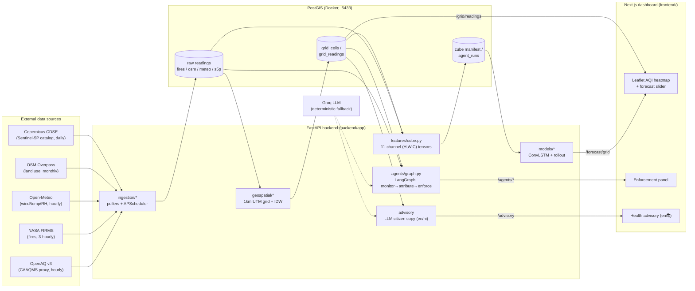

# Architecture — UrbanAir Intel

Folder ↔ box mapping: every box names its implementing module. The grid
(`grid_cells.row_idx/col_idx`) is the shared spatial index — ingestion output,
feature cubes, forecasts, and agent output all address cells by the same
`grid_id`, which is what makes adding a second city a one-line bbox change in
`ingestion/cities.py`.
